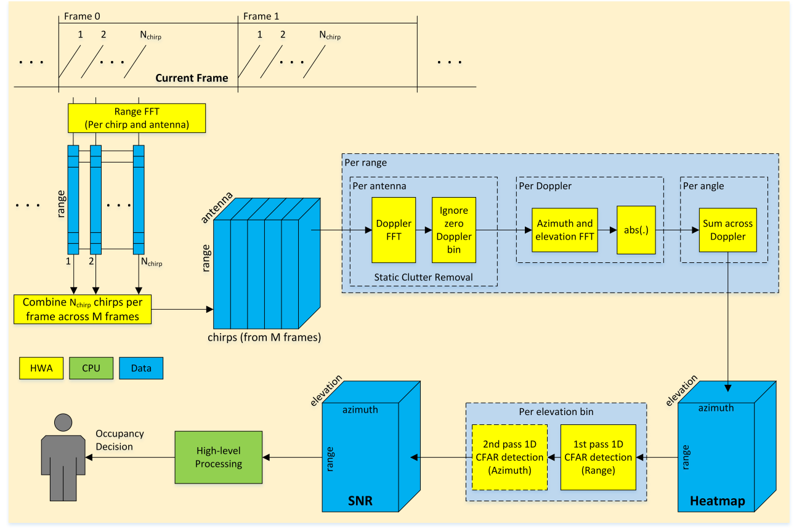

# Parameter Tuning Guide for the Intrusion Detection Demo – v0.3

> **源文件名**: Parameter_Tuning_Guide_for_Intrusion_Detection_Demo.pdf
> **源文件绝对路径**: `C:\ti\radar_toolbox_3_30_00_06\source\ti\examples\Automotive_InCabin_Security_and_Safety\AWRL6844_InCabin_Demos\docs\Intrusion_Detection\Parameter_Tuning_Guide_for_Intrusion_Detection_Demo.pdf`
> **作者**: Muhammet Emin Yanik
> **PDF标题**: Parameter Tuning Guide for the Intrusion Detection Demo – v0.3
> **创建程序**: Microsoft® Word 2019
> **页数**: 18
> **文件大小**: 756.1 KB
> **转换时间**: 2025-12-25 14:11:05
> **提取图片**: 10 张

---

## Parameter Tuning Guide for the

## Version 0.3

<!-- 第 1 页结束 -->

## Version History

#### Ver.

<!-- 第 2 页结束 -->

## Table of Contents

1
Introduction and Scope ......................................................................................................................... 4

2
Configuration Parameters ..................................................................................................................... 7

1. 1 Sensor Front-End Parameters .......................................................................................................... 8

1. 2 Detection Layer Parameters ............................................................................................................ 8

1. 2.1
2. Processing Chain Configuration .............................................................................................. 9

1. 2.2
2. CFAR Configuration ............................................................................................................... 10

1. 2.3
2. Clutter Removal Configuration ............................................................................................. 12

1. 2.4
2. Antenna Pattern Configuration ............................................................................................. 12

1. 2.5
2. Range Bias and Phase Compensation Configuration ............................................................ 13

1. 2.6
2. GUI Monitoring Configuration .............................................................................................. 14

1. 3 High-Level Processing Parameters ................................................................................................. 15

1. 3.1
2. Scene Configuration .............................................................................................................. 15

3
References .......................................................................................................................................... 18

1. 3.2
2. State Transition Configuration .............................................................................................. 16

<!-- 第 3 页结束 -->

## 1 Introduction and Scope

This document provides a high-level overview of the signal processing chain developed for intrusion
detection applications. It presents a guide for the user to tune this demo for different environments. It
aims to explain the configurable processing chain parameters, which the user can tune to improve the
overall demo performance. It is important to note that the scope of this document is limited to the
performance tuning level. The implementation details of the processing chain, including the execution
flow, memory management, etc., will be given in a separate demo implementation guide.

The processing chain shown in Figure 1 first handles reflections from the three-dimensional (3D)
environment around the sensor and delivers the signal-to-noise ratio (SNR) estimations of each voxel
point defined in this 3D environment. The high-level processing layer then processes the estimated SNR
to give the final intrusion alert in the pre-defined scene boundaries of this 3D environment.

### Figure 1. The overall processing chain of the intrusion detection demo.

The analog-to-digital converter (ADC) data (i.e., the beat signal) from the sensor front-end is the input of
the processing chain. The 3D SNR matrix generated by the detection layer represents the SNR estimation
of each reflection point in range-azimuth-elevation domains. A high-level processing layer then processes
the SNR matrix to run the logic that decides whether a predefined region of interest (ROI) has an intrusion
event.

<!-- 第 4 页结束 -->

In the proposed high-level processing logic, we first partition the entire scene into target and reference
zones. Once we estimate the SNR information in every voxel point in the field of view (i.e., range, azimuth,
and elevation), we assign this information at each point to the predefined zones (e.g., target zones) where
the occupancy is expected to occur. We also define a reference zone in the same boundary region, where
an occupancy state is not expected (i.e., reference zone), and assign the extracted SNR information of the
corresponding voxel points to this reference zone. In an intruder detection task, the reference zone can
be the central region of the vehicle, while the target zones can be defined as the boundary regions of the
vehicle (e.g., windows and doors, etc.). This assignment is valid in a real-world intrusion scenario since the
central region of the vehicle cannot be occupied before the boundary regions; hence, the central region
can be used as a reference non-occupied zone. Therefore, the processing chain can detect an intrusion
when the reference zone is not occupied as planned, and the intrusion happens through the vehicle
boundary. As shown in Figure 2, a typical car boundary can be divided into six zones: (1)(2) Dashboards,
(3)(4) 1st Rows, (5)(6) 2nd Rows.

### Figure 2. Definitions of a typical car boundary that consists of a reference zone and multiple

As shown in Figure 3, there are some cases that may create false alarms with the basic SNR-to-zone
assignment process. In this scenario, while the person is outside, the leakage of the main beam into the
car boundary and also the sidelobes of the main beam create unwanted deviation (hence a false alarm)
in the target zones compared to the reference zone. To address these corner cases, we also used local
peak and sidelobe checks in the algorithm to avoid using such unwanted heatmap portions, as shown in
Figure 4.

<!-- 第 5 页结束 -->

### Figure 3. An example scenario that creates false alarms with the basic zone assignment step.

On the other hand, this additional filtering in the data may also reduce the detection performance of real
intrusion events. To address all these false alarm mitigations by not sacrificing the detection performance,
a peak expansion approach around the extracted local peak is used, as illustrated in Figure 4. Enabling the
local peak check, configuring the sidelobe threshold in the sidelobe check, and also configuring the
number of samples expanded around the local peaks can all be configured by the user, as discussed in
Section 2.

### Figure 4. Local peak check, sidelobe check, and peak expansion in the processing chain.

<!-- 第 6 页结束 -->

## 2 Configuration Parameters

The parameters presented in this section are used to configure the intrusion detection demo and can be
adjusted to match the use cases based on the particular scenery characteristics. The user can set the
configuration parameters using the configuration (i.e., cfg) files in the demo application folders. An
example configuration file is given in Table 1. Each line in these files represents a CLI message that
configures several parameters. It is important to note that Table 1 may not have the correct sequence of
the commands that the demo requires. Besides, there may be some other commands in the cfg files that
are not listed in these tables. For the complete command set and the correct sequence, please refer to
the cfg files in the demo application folders and the SDK documents [1].

### Table 1. The commands in an example configuration (cfg) file for the demo.

#### No Parameter group CLI commands and arguments

1
Sensor front-end
parameters

sensorStop 0
channelCfg 15 15 0
chirpComnCfg 80 0 0 128 1 63 0
chirpTimingCfg 7 24 0 60 57
frameCfg 16 0 1400 1 100 0
sensorStart 0 0 0 0
2
Detection layer
parameters

runningMode 0
sigProcChainCfg 16 16 2
sigProcChainCommonCfg 4
cfarCfg 2 8 4 3 0
cfarScndPassCfg 1 2 4 3 2 1
clutterRemoval 1
antGeometryCfg  0 2 1 2 1 3 0 3  0 0 1 0 1 1 0 1  2 0 3 0 3 1 2 1  2 2 3 2 3 3 2 3
compRangeBiasAndRxChanPhase 0.0  -1 0 -1 0 -1 0 -1 0  1 0 1 0 1 0 1 0  -1 0 -1 0 -1 0
-1 0  1 0 1 0 1 0 1 0
guiMonitor 0 0 0 0 1 0 0
4
High-level
processing
parameters

### sensorPosition 0 0 1 0 -60

<!-- 第 7 页结束 -->

This document elaborates specifically on the supported configuration parameters in the intrusion
detection demo. The remaining parameters (and the configuration options they provide) that are not
detailed in this document (especially at the sensor front-end level) can be found in the SDK documentation
[1]. It is important to emphasize that we recommend using the provided values of the configuration
parameters as the best empirical values we obtained from testing in different environments.

## 2.1 Sensor Front-End Parameters

The sensor front-end parameters configure the intrusion detection demo at the frequency-modulated
continuous wave (FMCW) signal level. To get a general understanding of the sensor front-end parameters,
please refer to the SDK [1]. The example configuration file proposed in this demo uses a high-BW chirp
configuration with four chirps per TX (real-only baseband) in Time-Division Multiplexing (TDM) mode, as
summarized in Table 2.

### Table 2. The chirp configuration proposed in the example configuration (cfg) file.

#### Chirp Parameters and System Performance:

Starting frequency
GHz
57.0

Ramp slope
(MHz/µs) 60.0

Number of samples per chirp
-
128

Number of chirp loops per TX
-
4

Sampling frequency
Msps
2.5

Idle time (for all TXs)
µs
7

ADC start time
µs
9.6

Excess ramping time
µs
2.2

Chirp time, Tc
µs
51.2

Ramp end time
µs
63.0

Valid sweep bandwidth, B
MHz
3072

Total sweep bandwidth, B
MHz
3780

Frame period
ms
100
Maximum range
m
2.5
Range resolution
cm
4.88

## 2.2 Detection Layer Parameters

In the following subsections, the detection layer configuration parameters summarized in Table 1 are
detailed. Each table in this section presents the data type and description of each parameter along with
the suggested values in an example scenario. Recall that the data types are only classified as ‘int’ for
integer numbers and ‘float’ for floating-point numbers. This document does not cover the actual byte size
of the parameters (uint8, int32, etc.). Instead, the supported values or valid ranges in each parameter are

<!-- 第 8 页结束 -->

given in the corresponding section. For more details about the actual data size, please refer to the
implementation's source code.

### 2.2.1 Processing Chain Configuration

The following command configures the demo to run the intrusion detection application.

#### runningMode 0

#### Parameter

runningMode
int
0
Set to 0 to run the intrusion detection
application. All the supported modes are:

▪ 0: Intrusion detection
▪ 1: Seat belt reminder (SBR)
▪ 2: Child presence detection (CPD)
The tuning parameters of the SBR and CPD
applications are detailed in a separate
document.

The following command configures the parameters of the detection layer processing chain in Table 1.

#### sigProcChainCfg 16 16 2

#### Parameter

azimuthFftSize
int
16
Azimuth FFT size. Set as power of 2.
Refer to the note below1 for the details.
elevationFftSize
int
16
Elevation FFT size. Set as power of 2.
Refer to the note below1 for the details.
coherentDoppler
int
2
Set to 2.

1azimuthFftSize and elevationFftSize: These parameters define the azimuth and elevation FFT sizes in the
angle estimation steps. Both parameters, which affect the search granularity (i.e., the inter-bin resolution)
in the angle domain, have a significant impact on the processing load (also affects the power
consumption). Hence, both parameters should be carefully optimized for the desired use case. Depending
on the use case restrictions (power consumption, frame rate, etc.), small azimuth and elevation FFT sizes
may be required. This will create coarse angle steps in the azimuth-elevation grid.

As illustrated in Figure 1, the signal processing chain can work both with major processing and minor
processing modes. If a major processing mode is selected, only the chirps available within the given frame
will be used in the processing chain. If the minor processing mode is selected, the chirps across multiple
frames will be combined in the chain to achieve a better velocity resolution. Depending on the processing
mode selected, only a single SNR matrix is provided to the high-level processing block. The following
command configures the number of frames used in the processing chain. In this command, configuring 1
means using a single frame (i.e., major mode), and configuring N (>1) means using N number of frames
(i.e., minor mode). It is suggested that minor motion modes be set to create enough velocity resolution
with a limited number of chirps per frame (to save power).

<!-- 第 9 页结束 -->

#### sigProcChainCommonCfg 4

#### Parameter

numFrmPerSlidingWindow
int
4
Number of frames included for minor motion
detection.
Refer to the note below1 for the details.

1numFrmPerSlidingWindow: The detection layer chain utilizes the combined chirp blocks from the
current and previous frames to increase the chirping window for minor and very fine motions. This
parameter defines the number of frames included for minor motion detection mode (1 means major
mode with a single frame).  These parameters are closely related to the number of chirps available in a
single frame and the total retention time desired to detect minor motions. In this mode, all the available
chirps defined in the frameCfg command will be concatenated to generate the total chirp block across
frames. Besides, when configuring these parameters, the frame rate should also be considered. Finally,
the total number of chirps in the chirp block created across multiple frames must be a power of 2.

### 2.2.2 CFAR Configuration

In the processing chain, the two-pass CFAR algorithm is applied directly to the generated 3D range-
azimuth-elevation heatmap. In this two-pass CFAR algorithm, the first-pass scanning on each angle bin
runs the 1D-CFAR logic to estimate noise across the range bins. The commands needed for the first-pass
CFAR are given in the table below.

#### cfarCfg 2 8 4 3 0

#### Parameter

averageMode
int
2
CFAR averaging mode selection:

1. 0: CFAR-CA.
2. 1: CFAR-CAGO.
3. 2: CFAR-CASO.
4. Suggested to set 2.
5. winLen
6. int
7. 8
8. One-sided noise averaging window length (in samples) of
9. range-CFAR.
10. Suggested to set as power of 2.
11. guardLen
12. int
13. 4
14. One-sided guard length (in samples) of range-CFAR.
15. noiseDiv
16. int
17. 3
18. Cumulative noise sum divisor expressed as a shift. Sum
19. of noise samples is divided by 2^noiseDiv.
20. Should be set as log2(winLen).
21. cyclicMode
22. int
23. 0
24. Cyclic mode or wrapped around mode:

1. 0: Disabled.
2. 1: Enabled.
3. Suggested to disable in range-domain CFAR.

In the processing chain, the second-pass CFAR is optional. When enabled, the second-pass scanning on
each range bin runs the CFAR logic to estimate noise across the angle bins. After the second-pass CFAR,
the overall noise is then estimated by the average of the noise estimations from the first and second

<!-- 第 10 页结束 -->

passes. The commands needed for the second-pass CFAR are given in the table below. It is important to
note that the second-pass CFAR runs across azimuth bins. Since the input heatmap is 3D in range-azimuth-
elevation domains, the two-pass CFAR logic runs per elevation bin separately.

#### cfarScndPassCfg 1 2 4 3 2 1

#### Parameter

enabled
int
1
Enable/disable the second pass CFAR:

1. 0: Disabled.
2. 1: Enabled.
3. averageMode
4. int
5. 2
6. CFAR averaging mode selection:

1. 0: CFAR-CA.
2. 1: CFAR-CAGO.
3. 2: CFAR-CASO.
4. Suggested to set 2.
5. winLen
6. int
7. 4

One-sided noise averaging window length (in samples) of
angle-CFAR.
Suggested to set as power of 2.
guardLen
int
3
One-sided guard length (in samples) of angle-CFAR.
noiseDiv
int
2
Cumulative noise sum divisor expressed as a shift. Sum
of noise samples is divided by 2^noiseDiv.
Should be set as log2(winLen).
cyclicMode
int
1
Cyclic mode or wrapped around mode:

1. 0: Disabled.
2. 1: Enabled.
3. Suggested to enable in angle-domain CFAR.

The following parameter configures the HWA CFAR engine to decide the version of the CFAR-CA method
performed in either range or azimuth domains.

averageMode: This field configures the mode of the CFAR method in any of the following options:

▪ CFAR CA (cell averaging): The average of both left and right reference windows is used as noise

estimation for CFAR detection.
▪ CFAR CAGO (cell averaging with greater of selection): The greater average of the left and right

reference windows are used as noise estimation for the CFAR detection.
▪ CFAR CASO (cell averaging with smaller of selection): The smaller average of the left and right

reference windows is used as noise estimation for the CFAR detection.

The following CFAR window parameters are used to configure the HWA CFAR engine and define a sliding
window to calculate the local noise floor to be compared with the cell under test (CUT).

winLen: This field is the CFAR reference window length (in terms of the number of samples) for CFARs.

guardLen: This field is the CFAR guard window size (in terms of the number of samples). When calculating
the noise estimation, the left and right guardLen of samples will be excluded from noise accumulation.

<!-- 第 11 页结束 -->

For example, if we have a target with an area of 0.5m2 reflecting radar energy, we do not want samples
in those areas being counted as noise samples to raise the detection threshold. The user should adjust
the setting based on the chirp configuration and derived inter-bin resolution, as well as the typical target
size within the scene.

noiseDiv: This parameter specifies the division factor with which the noise sum calculated from the left
and right noise windows are divided in order to get the final surrounding noise average value. The division
factor is equal to 2^noiseDiv. Therefore, only powers-of-2 division is possible, even though the number of
samples specified in winLen is not restricted to powers of 2.

cyclicMode: This parameter specifies whether the CFAR-CA detector needs to work in cyclic mode or in
non-cyclic mode. When this field is 0, the CFAR detector works in non-cyclic mode, and when it is 1, it
works in cyclic mode. These two modes are different in the way the samples at the edges are handled. In
cyclic mode, the CFAR-CA detector needs to wrap around the edges in a circular manner.

### 2.2.3 Clutter Removal Configuration

The following parameter enables/disables the clutter removal step. Because the main goal of the intrusion
detection chain is to detect motions in the scene, this parameter must always be set to 1. This parameter
is included in the cfg file for debugging or when analyzing the reflections from the static scenes.

#### clutterRemoval 1

#### Parameter

enabled
int
1
Configure static clutter removal:

1. 0: Disabled.
2. 1: Enabled.
3. Always set to 1 if it is desired to detect moving objects
4. only (person, etc.) in the scene.

### 2.2.4 Antenna Pattern Configuration

The intrusion detection demo can support different antenna configurations. Although the default
parameters of the demo are configured according to the xWRL6844 EVM [2], the user can change the
layout using the following command. In this command, the row and column index of each antenna define
the virtual antennas' physical location index (0, 1, 2, …) in the elevation and azimuth domains, respectively.
In other words, for the xWRL6844 EVM antenna pattern shown in Figure 5, these index values indicate
four elevation rows (specified by 0, 1, 2, 3), and four azimuth columns (specified by 0, 1, 2, 3) on each
elevation row.

<!-- 第 12 页结束 -->

Row
Index

4
1
8
5

3
2
7
6

RX3
RX2

RX1
TX1
TX2

RX4

11
10

12
9

3
2
1
0

16
13

15
14

Column
Index

TX4
TX3

### Figure 5. The antenna pattern of the xWRL6844 EVM and the corresponding index values.

antGeometryCfg  0 2 1 2 1 3 0 3  0 0 1 0 1 1 0 1  2 0 3 0 3 1 2 1  2 2 3 2 3 3 2 3  2.540 2.540

#### Parameter

ant1IdxRow
int
0
Row index of virtual antenna 1 (TxAnt1->RxAnt1).
ant1IdxCol
int
2
Column index of virtual antenna 1 (TxAnt1->RxAnt1).
ant2IdxRow
int
1
Row index of virtual antenna 2 (TxAnt1->RxAnt2).
ant2IdxCol
int
2
Column index of virtual antenna 2 (TxAnt1->RxAnt2).
…
…
…
…
ant16IdxRow
int
2
Row index of virtual antenna 16 (TxAnt4->RxAnt4).
ant16IdxCol
int
3
Column index of virtual antenna 16 (TxAnt4->RxAnt4).
antDistCol
float
2.540
Antenna spacing in X dimension (i.e., between azimuth columns) in
mm. This is an optional argument. If omitted, it is assumed that d =
λ/2, where λ (wavelength) is computed based on the center
frequency of the chirp configuration. It is assumed that the azimuth
columns are uniformly distributed.
The value given here (2.540mm) is the antenna spacing for
wWRL6844 EVM [2].
antDistRow
float
2.540
Antenna spacing in Z dimension (i.e., between elevation rows) in
mm. This is an optional argument. If omitted, it is assumed that d =
λ/2, where λ (wavelength) is computed based on the center
frequency of the chirp configuration. It is assumed that the elevation
rows are uniformly distributed.
The value given here (2.540mm) is the antenna spacing for
wWRL6844 EVM [2].

### 2.2.5 Range Bias and Phase Compensation Configuration

This set of range and phase compensation parameters can be derived using a corner reflector at sensor
boresight (at about a few meters). If the user decides not to compensate for the bias, the default values
in the following table can be set in the configuration file.

<!-- 第 13 页结束 -->

compRangeBiasAndRxChanPhase 0.0 -1 0 -1 0 -1 0 -1 0 1 0 1 0 1 0 1 0 -1 0 -1 0 -1 0 -1 0 1 0 1 0 1 0 1 0

#### Parameter

rangeBias
float
0.0
Range bias common for all antennas.
ant1PhaseReal
float
-1
Phase compensation factor (real) of the 1st virtual antenna.
ant1PhaseImag
float
0
Phase compensation factor (imaginary) of the 1st virtual antenna.
ant2PhaseReal
float
-1
Phase compensation factor (real) of the 2nd virtual antenna.
ant2PhaseImag
float
0
Phase compensation factor (imaginary) of the 2nd virtual
antenna.
…
…
…
…
ant16PhaseReal  float
1
Phase compensation factor (real) of the 16th virtual antenna.
ant16PhaseImag float
0
Phase compensation factor (imaginary) of the 16th virtual
antenna.

It is also important to note that if the sensor is not calibrated and the default calibration coefficients are
used in the cfg file, the phase rotations at each transceiver should also be considered. Since some of the
antenna elements of the xWRL6844 are fed from the opposite direction, the phase rotations for those
virtual elements are set to -1. It is recommended to calibrate the sensor using a corner reflector as
discussed in SDK [1].

### 2.2.6 GUI Monitoring Configuration

The following command configures the output data of the intrusion detection demo streamed over the
UART port.

#### guiMonitor 0 0 0 0 1 0 0

#### Parameter

pointCloud
int
0
Not applicable for intrusion demo. Set to 0.
rangeProfile
int
0
Range profile data transmission enable/disable flag:

1. 0: Disable.
2. 1: Enable range profile from major mode
3. Refer to the note below1 for the details.
4. statsInfo
5. int
6. 0
7. Statistics information (processing time, etc.) transmission
8. enable/disable flag:

1. 0: Disable.
2. 1: Enable.
3. Refer to the note below2 for the details.
4. temperatureInfo
5. int
6. 0
7. Set to 0.
8. intrusionDetInfo
9. int
10. 1
11. Intrusion detection results enable/disable flag:

1. 0: Disable.
2. 1: Enable.
3. Refer to the note below3 for the details.
4. occFeatures
5. int
6. 0
7. Not applicable for intrusion demo. Set to 0.
8. occClassRes
9. int
10. 0
11. Not applicable for intrusion demo. Set to 0.

<!-- 第 14 页结束 -->

1rangeProfile: This parameter enables/disables the export of range profile (at the azimuth-elevation peaks
of the range-azimuth-elevation heatmap). Enabling these outputs impacts the throughput. Hence, these
parameters should be enabled only in the debug mode.

2statsInfo: This parameter enables or disables the export of statistical information about the
implementation, such as processing time and the UART transmission time. Both information can be used
for benchmarking and performance tuning.

3intrusionDetInfo: When this flag is enabled, the device will send intrusion detection results to the host
over the UART interface. The processing chain uses a cuboid-based zone mapping approach when running
the high-level logic. Therefore, enabling this flag will send the binary intrusion decision (i.e., 0 or 1) for
each zone to the host.

## 2.3 High-Level Processing Parameters

The configuration parameters presented in this section are used to configure the high-level processing
layer for the intrusion decision chain. These parameters should be adjusted to match the use cases based
on the particular scenery characteristics.

### 2.3.1 Scene Configuration

This set of parameters allows the user to configure the dimensions of the physical space in which the
demo chain will operate. These also specify the radar sensor orientation and position. It’s convenient to
first define mathematical spaces in which the measured data is obtained, the processing chain operates,
and the output is visualized. We define the following spaces which are applicable in any sensor mount
configurations:

- 
- World Space W: {Xw, Yw, Zw} is Cartesian with origin at floor level of a typical car scene
- 
- Sensor Cartesian Space T: {Xt, Yt, Zt}  is Cartesian with origin at the sensor
- 
- Sensor Spherical Space P: {r, 𝜑, 𝜃}  } is Spherical with origin at the sensor.  r is the radial distance,
- 𝜑 is the azimuth angle, and 𝜃 the elevation angle with respect to the sensor axis.

The sensor mounting geometry and its relation to the different measurement spaces are defined as:

- 
- Sensor location Sw = {xo, yo, zo} is specified in the world Cartesian space where xo, yo, and zo are the
- offsets of the sensor referenced to the origin (O).
- 
- All configuration boxes defined by the user are also in the world Cartesian space. The boundary
- box is specified by the coordinate values {x1, x2, y1, y2, z1, z2}.

The following boundary box command allows the user to configure the physical dimensions of the space
in which the intrusion decision will be provided. As discussed in Section 1, the intrusion decision logic can
be run in multiple zones within the entire scene. Hence, multiple boundary boxes can be configured.
Therefore, the entire scene can be divided into multiple boundary boxes, and each boundary box can be

<!-- 第 15 页结束 -->

sent to the device separately. This scheme will then allow running the decision logic per zone. Note that
each box should be defined in meters in the world coordinates in Cartesian space.

occupancyBox 0 -0.20 0.20 -0.30 1.00 0.00 1.05

#### Parameter

index
int
0
Index of the boundary box. It should start from 0 and increase
sequentially if multiple boundary boxes are defined.
The first occupancy box (index 0) must always be the reference
zone described in Section 1. Hence, the algorithm needs at least
two occupancy boxes (one for reference and one for target region).
xMin
float
-0.20
Minimum horizontal distance (in meters) with respect to the origin
in the world coordinates.
xMax
float
0.20
Maximum horizontal distance (in meters) with respect to the origin
in the world coordinates.
yMin
float
-0.30
Minimum vertical (i.e., depth) distance (in meters) with respect to
the origin in the world coordinates.
yMax
float
1.00
Maximum vertical (i.e., depth) distance (in meters) with respect to
the origin in the world coordinates.
zMin
float
0.00
Minimum height (in meters) with respect to the origin in the world
coordinates. Note that z = 0 corresponds to the ground plane.
zMax
float
1.05
Maximum height (in meters) with respect to the origin in the world
coordinates.

The following command can be used to specify the radar sensor orientation and position. The sensor
location Sw = {xOffset, yOffset, zOffset} is specified in the world Cartesian space referenced to the
boundary box origin.

#### sensorPosition 0 0 1 0 -60

#### Parameter

xOffset
float
0
Offset of the radar sensor position in x-axis referenced to the
boundary box origin.
yOffset
float
0
Offset of the radar sensor position in y-axis referenced to the
boundary box origin.
zOffset
float
1
Height of the radar sensor above the ground plane.
azimuthTilt
float
0
The azimuth tilt (in degrees) of the sensor about the axis Zw.
elevationTilt
float
-60
The elevation tilt of the sensor about the axis Xw A negative value
indicates tilting towards the ground from the vertical axis.

### 2.3.2 State Transition Configuration

Any zone configured can be in one of two states i.e., EMPTY or INTRUSION. The transition from one state
to another is determined by various parameters configured by the following command. This command
will configure the decision logic for every occupancy box with common parameters.

<!-- 第 16 页结束 -->

#### intruderDetCfg 12 2 10 2 0.9 2

#### Parameter

threshold
float
6
The occupancy signal needed in a zone to enter the INTRUSION
state. If the computed occupancy signal exceeds this threshold,
the algorithm will decide if an intrusion event occurs.
free2ActiveThre
int
2
In EMPTY state; threshold for the number of continuous HIT
events (in terms of number of frames) to transition from EMPTY
to INTRUSION state.
active2FreeThre
int
10
In INTRUSION state; threshold for the number of consecutive
MISS events (in terms of number of frames) needed to
transition from INTRUSION to EMPTY state.
localPeakCheck
int
2
Local peak check enable/disable flag:

1. 0: Disable.
2. 2: Enable.
3. Refer to the Section 1 for the details.
4. sideLobeThre
5. int
6. 9
7. Sidelobe threshold in the linear scale to declare a local peak as
8. the detected point (compared to the maximum local peak at the
9. same range bin). Refer to the Section 1 for the details. This
10. parameter will be used only if the localPeakCheck is enabled.
11. peakExpSamples
12. int
13. 2
14. Number of samples on each side to expand the peak of the
15. azimuth-elevation heatmap. Refer to the Section 1 for the
16. details. This parameter will be used only if the localPeakCheck is
17. enabled.

In the current demo, another version of this command has also been added to configure each occupancy
box separately. As seen in the following intruderDetAdvCfg, the index of the boundary box is added to the
parameters of the intruderDetCfg command. Note that the index in this command should match with the
index defined in occupancyBox command. If the user wants to use this command to configure each zone
separately instead of using a common intruderDetCfg command, they should configure multiple of this
command for each occupancy box separately except for the reference zone (index 0).

#### intruderDetAdvCfg 1 8 2 10 2 0.9 2

#### Parameter

#### index

<!-- 第 17 页结束 -->

## 3 References

[1]
MMWAVE-L-SDK: The mmWave low-power software development kit (SDK) for xWRL6844.
[Online]. Available: https://www.ti.com/tool/MMWAVE-L-SDK
[2]
xWRL6844 evaluation module for low-power single-chip 60GHz mmWave sensor, Texas
Instruments. [Online]. Available: https://www.ti.com/tool/TBD

<!-- 第 18 页结束 -->
