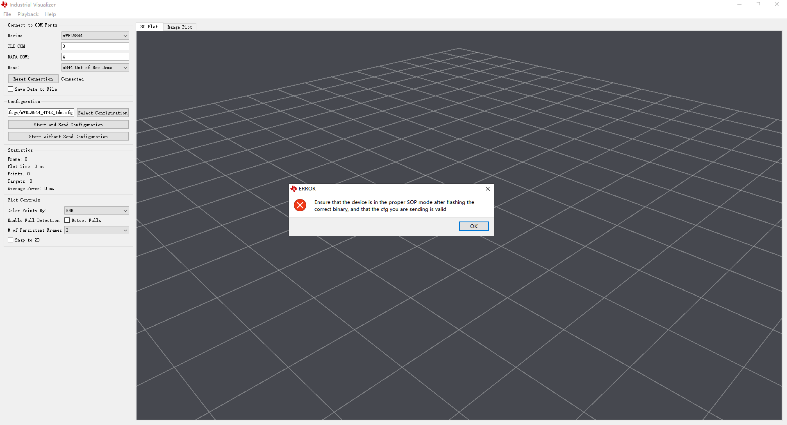

项目文档\3-固件工具\06-可视化研究

06-可视化研究, 学习知识库资料,ti 官方资料, ti 

INFO     [gui_core.py:275] CLI COM Port found: COM3
INFO     [gui_core.py:284] Data COM Port found: COM4
INFO     [gui_parser.py:289] Connected
ERROR    [gui_parser.py:321] ERROR: No data detected on COM Port, read timed out
ERROR    [gui_parser.py:322]    Be sure that the device is in the proper SOP mode after flashing with the correct binary, and that the cfg you are sending is valid
ERROR    [gui_parser.py:79] ERROR: No data detected on COM Port, read timed out
ERROR    [gui_parser.py:80]     Be sure that the device is in the proper mode, and that the cfg you are sending is valid
ERROR    [gui_parser.py:79] ERROR: No data detected on COM Port, read timed out
ERROR    [gui_parser.py:80]     Be sure that the device is in the proper mode, and that the cfg you are sending is valid
ERROR    [gui_parser.py:79] ERROR: No data detected on COM Port, read timed out
ERROR    [gui_parser.py:80]     Be sure that the device is in the proper mode, and that the cfg you are sending is valid
ERROR    [gui_parser.py:79] ERROR: No data detected on COM Port, read timed out
ERROR    [gui_parser.py:80]     Be sure that the device is in the proper mode, and that the cfg you are sending is valid
ERROR    [gui_parser.py:79] ERROR: No data detected on COM Port, read timed out
ERROR    [gui_parser.py:80]     Be sure that the device is in the proper mode, and that the cfg you are sending is valid
ERROR    [gui_parser.py:79] ERROR: No data detected on COM Port, read timed out
ERROR    [gui_parser.py:80]     Be sure that the device is in the proper mode, and that the cfg you are sending is valid
ERROR    [gui_parser.py:79] ERROR: No data detected on COM Port, read timed out
ERROR    [gui_parser.py:80]     Be sure that the device is in the proper mode, and that the cfg you are sending is valid
ERROR    [gui_parser.py:79] ERROR: No data detected on COM Port, read timed out
ERROR    [gui_parser.py:80]     Be sure that the device is in the proper mode, and that the cfg you are sending is valid
ERROR    [gui_parser.py:79] ERROR: No data detected on COM Port, read timed out
ERROR    [gui_parser.py:80]     Be sure that the device is in the proper mode, and that the cfg you are sending is valid
ERROR    [gui_parser.py:79] ERROR: No data detected on COM Port, read timed out
ERROR    [gui_parser.py:80]     Be sure that the device is in the proper mode, and that the cfg you are sending is valid
ERROR    [gui_parser.py:79] ERROR: No data detected on COM Port, read timed out
ERROR    [gui_parser.py:80]     Be sure that the device is in the proper mode, and that the cfg you are sending is valid
ERROR    [gui_parser.py:79] ERROR: No data detected on COM Port, read timed out
ERROR    [gui_parser.py:80]     Be sure that the device is in the proper mode, and that the cfg you are sending is valid
ERROR    [gui_parser.py:79] ERROR: No data detected on COM Port, read timed out
ERROR    [gui_parser.py:80]     Be sure that the device is in the proper mode, and that the cfg you are sending is valid
ERROR    [gui_parser.py:79] ERROR: No data detected on COM Port, read timed out
ERROR    [gui_parser.py:80]     Be sure that the device is in the proper mode, and that the cfg you are sending is valid
ERROR    [gui_parser.py:79] ERROR: No data detected on COM Port, read timed out
ERROR    [gui_parser.py:80]     Be sure that the device is in the proper mode, and that the cfg you are sending is valid
Traceback (most recent call last):
  File "gui_core.py", line 381, in sendCfg
    self.displayErrorPopUp()
  File "gui_core.py", line 321, in displayErrorPopUp
    popUp.exec_()
AttributeError: 'PySide2.QtWidgets.QMessageBox.StandardButton' object has no attribute 'exec_'
ERROR    [gui_parser.py:79] ERROR: No data detected on COM Port, read timed out
ERROR    [gui_parser.py:80]     Be sure that the device is in the proper mode, and that the cfg you are sending is valid
ERROR    [gui_core.py:779] Unable to reset the device. Check your xds reset path in <Industrial_Visualizer\misc\path.json
