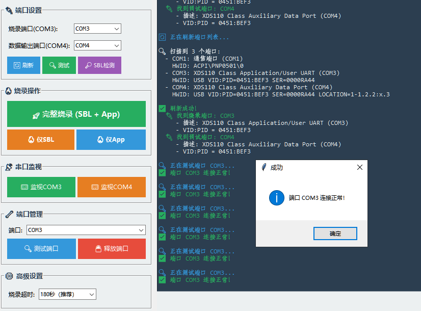
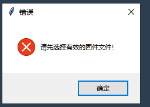

项目文档\3-固件工具\01-AWRL6844固件系统工具\5-Scripts\flash_tool.py

完善源代码, 做成gui应用程序功能如下:

v1.0.0

1. 版本标记
2. 烧录完成后需要做com3, com4 端口检验
3. 功能分框: 源固件, 烧录分类,进度,日志,超时设置,错误提示,端口测试,端口设置,默认端口

v1.0.1

1.启动时检查是否有老进程存在,并提醒是否关闭并开启新窗口.避免旧版窗口还未关闭,就可以直接新打开的窗口?

2. 源固件可以选择, 另外设置一个打开目标目录的按钮
3. 项目文档\3-固件工具\01-AWRL6844固件系统工具\5-Scripts\flash_tool_gui.py与项目文档\3-固件工具\01-AWRL6844固件系统工具\5-Scripts\flash_tool.py合并成一个gui 脚本,删除命令行脚本.
4. 增加释放com3,com4端口功能,避免被其他应用占用

v1.0.2

1. 显示固件的绝对路径
2. 需要确认 是否SOP设置及是否重启板子 的步骤前弹出窗口, 需要设置完毕并勾选完毕后, 才能继续执行.
3. 单独显示两个端口的通讯数据流,用与测试确认烧录好的固件可以正常通讯的.

v1.0.3

1.添加该app作者为: Benson@Wisefido

2. 搜索知识库官方资料及官方网络资料, 确认是否可以在未烧录前读取板子的sbl及应用固件信息??如果可以加入读取功能.
3. 是否可以烧录前读取端口是否正常? 另外读取外记得释放端口,以免在烧录时端口被占用.

v1.0.4

1. 该app为AWRL6844EVM专用, 启动时显示AWRL6844EVM, 另外扩展后续其他板子的烧录选择性.

V1.0.5

1.选择的SBL与应用固件 能否判别是否与AWRL6844EVM匹配呢? 有方法吗?

2.如果有方法判别, 将判别结果及判别匹配原因也列举出

V1.0.6

1. 切换设备后, 弹出窗口无法关闭. 另外后续设备只会是6844系列,而不会是别的设备.
2. 窗口大小设置成自适应,可以最大化, 可以任意大小,字体随着自适应大小 因为当前界面的字体太小,看不到,例如作者部分就被截断看不到.
3. 为什么SBL固件打开就被认定为验证失败??

v1.0.7

1. 默认打开的烧录操作中,只有完整烧录, 看不到SBL烧录及APP烧录.
2. 如果判别只需要APP烧录而不需要烧录SBL呢?
3. 烧录地址offset是自动的吗?
4. 默认打开窗口功能是看不全的. 1080也无法看到端口管理的全部. 2K分辨率下串口监视器也看不全.如何解决在任意窗口下看到所有功能.是否要引入菜单或标签管理,不同的菜单或标签显示不同的界面呢?

v1.0.8

使用标签化管理时, flash_tool.py单一一个脚本,代码会太大,不好管理,将各个标签变成一个脚本文件, 分片管理.以flash_tool.py作为总入口. 如果单独打开任意一个标签脚本时,会提醒从flash_tool.py 文件入口打开,你看这样是不是好一点. 在生成代码的过程中,记着及时更新github来保存每个阶段,以便文件被损坏重新来.

v1.0.9

1. V1.0.8形成模块化架构时是否有简化代码的行为? 如果有,现在需要把简化的代码补全. 把偷懒部分补回来.
2. 在重构的过程中,重新检查项目文档\1-需求与设计\烧录工具.md中v1.0.7之前(包含v1.0.7)的所有要求一一检查,见文件,是否有未达到部分?如果有,请补全代码
3. 我们V1.0.7讨论**问题**：如何判断只需要烧录App而不需要烧录SBL？您的答复如下

**问题**：如何判断只需要烧录App而不需要烧录SBL？

**分析**：

1. **首次烧录**：必须SBL+App完整烧录
2. **应用更新**：只需烧录App
3. **SBL损坏**：只需烧录SBL

**判断依据**：

- 板载是否有SBL：通过测试COM3/COM4端口
- SBL版本信息：需要读取板载固件信息
- 用户选择：提供选项让用户决定

这里面有个很有意思的事情,之前不是说不可以读取板载固件信息吗. 为什么现在又答复我SBL版本信息：需要读取板载固件信息.

v1.1.0

你在v1.0.9中得出如下结论:

 **结论** ：

* v1.0.3的需求："读取板载固件信息" → 经调研后发现**无法实现**
* v1.0.7的答复："需要读取板载固件信息" →  **措辞不当** ，实际是"通过串口通信判断SBL是否存在"

你的意思是通过串口通信可以判断SBL是否存在.   那就实现这个功能. 单独列出这个功能.

V1.1.1

1.再增加一个固件文件的标签: 展示C:\ti 中demo固件文件配对列举出来,并详细解释这个固件作用,.syscofig及对应的.cfg文件, 及对应的绝对路径,方便直接COPY到首页的固件路径中,及为下一步可视化测试做准备.

2.代码质量可以进一步优化  3. 是否有SBL及应用固件匹配AWRL6844EVM的提示??

v1.1.2

1. 为什么扫描C:\ti\MMWAVE_L_SDK_06_01_00_01 未找到demo固件???
2. c:\ti目录中的固件库有没有在其他目录中?如果有 把这些大目录预置到APP中,例如 C:\ti\radar_toolbox_3_30_00_06,查询一下c:\ti所有目录再做决定.
3. 必须提醒固件库必须是对应AWRL6844EVM可用的
4. v1.1.1提到的配对配置文件有展示吗?

v1.1.3

1. 为什么固件列表只有3个?
2. 把固件库标签中搜索的文件分为4类配套: sbl, 应用固件, sysconfig文件,RTOS .cfg文件,

v1.2.0

按照下面文件重构:D:\7.项目资料\Ti雷达项目\项目文档\2-开发记录\2025-12-15\2025-12-15_v1.2.0固件库重构设计.md

v1.2.0

1. **左侧列表宽度没感觉又增加,设置成50/50, 并可以使用鼠标点左右中间线可自由调整比例.**
2. **默认扫描路径 不要直接设置在app的脚本中, 可以默认这些官方目录没有问题,但也要可以随时删除,添加.**
3. **HelloWorld**固件本来就是c:\ti 目录下的官方资料,D:\7.项目资料\Ti雷达项目\项目文档\3-固件工具\01-AWRL6844固件系统工具这个目录不需要默认添加进去,因为它不是官方默认目录.为了强制搜索到**HelloWorld**固件而把自定义的固件目录添加进去是懒惰行为. 应该找一下为什么没有在c:\ti 没有搜索到**HelloWorld**固件具体原因.
4. 没有看到管理扫描路径, 与原来的界面一样,没变化.

v1.2.2

1. 我是两个显示器, 我点开管理扫描路径弹出的窗口与我的主窗口不在一个显示器内,并且窗口也不可移动.修复BUG.
2. 搜索到一堆hello world ,但又不知道区别.该如何选择区分??
3. 在应用固件中只看到名字,具体路径也看不到.建议所有文件都要显示详细的绝对路径.

v1.2.3

重启的APP为什么没有在所有界面的最前端, 必须再点一次任务栏的图片,才会再最前面. fix it.

v1.2.4

SysConfig配置
x 未找到
RTOS配置X 未找到    ,我点了所有固件,这是为什么?

v1.2.5

1.为什么停止了版本更新

2. 那hello world固件为例, 显示兼容性未知, 如果是为止,为什么会显示在固件库中呢. 况且均在C:\ti\MMWAVE_L_SDK_06_01_00_01\examples\hello_world\xwrL684x-evm 目录下, 是兼容的.所以兼容性下方提供判定兼容原因. 文件名判断或项目目录判断,这个逻辑没错吧.
3. 如果SysConfig配置,RTOS配置, 未找到 -仅源代码项目包含，预编译固件无此文件, 那么它的源代码目录在哪里?不能自动关联吗? 如果能关联, 请提供并显示文件名及对应目录.
4. 固件库中的hello world 有四个固件文件, 但我觉得逻辑是他们属于同一个固件项目, 所以在固件项目列表中只能显示为一个固件项目, 有4个固件文件的话, 需要在右框中显示此固件项目中所有的固件文件,并在最右面再加一个列框, 比较四个固件的区别.以便知道选择哪一个?

SBL、固件变体、雷达配置、完整分析

v.1.2.6

删除目录树标签页

** v1.2.7！**

📝  **更新日志** ：

* 删除了目录树标签页
* 删除了4个分析标签页（SBL、固件变体、雷达配置、完整分析）
* 删除了约900行硬编码的分析方法
* 代码从2738行精简到1544行（减少43.6%）
* 只保留文件信息标签页

v1.2.8

继续精简,删除项目文档\3-固件工具\01-AWRL6844固件系统工具\5-Scripts\tabs\tab_firmware_lib.py 中无关的代码

V1.2.9

项目文档\3-固件工具\01-AWRL6844固件系统工具\5-Scripts\tabs\tab_firmware_lib.py 标签脚本中,只以固件.appimage为核心来收集固件项目, 去掉.bin

v1.3.0

把以下功能全部删除

1. **🔧 SBL引导固件**
   * 推荐的SBL列表（最多3个）
   * 优先级图标（⭐⭐⭐）
   * 推荐原因和来源
   * "选择其他SBL"按钮
2. **📡 雷达参数配置**
   * 推荐的配置文件列表（最多3个）
   * 优先级图标
   * 推荐原因和来源
   * 无配置文件时显示友好解释（[_get_no_radar_cfg_reason](vscode-file://vscode-app/c:/Users/Administrator/AppData/Local/Programs/Microsoft%20VS%20Code/resources/app/out/vs/code/electron-browser/workbench/workbench.html)方法）

v1.3.1

0.更新完脚本后,更新主程序的版本号. 然后打开主APP,检查更行界面及功能.

1. 在固件库-文件路径标签页中: 列出所有应用.appimage固件, 每个固件都包含:文件名,大小,完整路径
2. 在固件库标签页,增加一个导出所有固件项目列表功能, 导出格式为.md

v1.3.2

0.更新完脚本后,更新主程序的版本号. 然后打开主APP,检查更行界面及功能.

1. 我要的是点击对应固件项目列出对应项目.appimage固件,我要的不是在**固件库标签页**一次性展示所有项目的固件列表

v1.3.3

0.更新完脚本后,更新主程序的版本号. 然后打开主APP,检查更行界面及功能.

1. 删除固件库标签,并删除对应的脚本文件

v1.3.4

0.更新完脚本后,更新主程序的版本号. 然后打开主APP,检查更行界面及功能.

1. 建立一个空白标签,名字为:固件管理

v1.3.5

0.更新完脚本后,更新主程序的版本号. 然后打开主APP,检查更行界面及功能.

1. 将D:\7.项目资料\Ti雷达项目\project-code\code_search 系统集成到D:\7.项目资料\Ti雷达项目\项目文档\3-固件工具\01-AWRL6844固件系统工具的 固体管理 标签页.

项目文档\3-固件工具\01-AWRL6844固件系统工具

v1.3.6

0.更新完脚本后,更新主程序的版本号. 然后打开主APP,检查更行界面及功能.

1. 集成的固体管理 标签页 缺少了扫描目录管理. 填补上去

项目文档\3-固件工具\01-AWRL6844固件系统工具

v1.3.7

0.更新完脚本后,更新主程序的版本号. 然后打开主APP,检查更行界面及功能

1.固体管理 标签页bug修复列表:

1.1 删除扫描控制框中 扫描目录,添加,删除 功能, 因为与 扫描目录子标签 功能重复.

1.2 多次扫描目录,  扫描出的文件不不断累积重复, 修复它.

项目文档\3-固件工具\01-AWRL6844固件系统工具

v1.3.8

0.更新完脚本后,更新主程序的版本号. 然后打开主APP,检查更行界面及功能

1.固体管理 标签页bug修复列表:

1.2 清空所有后, 扫描目录列表依然存在.

1.3  +添加目录功能无效

1.4 -删除功能无效

项目文档\3-固件工具\01-AWRL6844固件系统工具

v1.3.9

0.更新完脚本后,更新主程序的版本号. 然后打开主APP,检查更行界面及功能

1. 标签页 固件管理-应用固件: 详细信息框 太小,无法一次性完全显示内容. 把框设置成自适应. 另外框可以使用鼠标调整
2. 标签页 固件管理-SBL固件: 详细信息框 太小,无法一次性完全显示内容. 把框设置成自适应. 另外框可以使用鼠标调整
3. 标签页 固件管理-雷达配置: 详细信息框 太小,无法一次性完全显示内容. 把框设置成自适应. 另外框可以使用鼠标调整
4. 所有的标签页中的文件名及路径 实现可以复制功能.

项目文档\3-固件工具\01-AWRL6844固件系统工具

v1.4.0

0.更新完脚本后,更新主程序的版本号. 然后打开主APP,检查更行界面及功能

1. bug修复:  1.1 只需要复制所有的标签页中的文件名及路径 ,不需要实现复制行与所有数据

项目文档\3-固件工具\01-AWRL6844固件系统工具

v1.4.1

0.更新完脚本后,更新主程序的版本号. 同步更新github 本地与远程. 然后打开主APP,检查更行界面及功能

1.标签页 固件管理-智能匹配 功能增加:

1.1 .增加搜索应用固件功能.

1.2  增加一键添加烧录文件功能, 将选中标签页 固件管理-智能匹配中选中的应用固件 及SBL固件的绝对路径添加到 到基本烧录 主标签页的SBL固件及app固件中.

v1.4.2

0.更新完脚本后,更新主程序的版本号. 同步更新github 本地与远程. 然后打开主APP,检查更行界面及功能

1.标签页 基本烧录中:

1.1 烧录工具未找到? 修复它

1.2 打开目录功能 及分析功能是做扫描的呢?

项目文档\3-固件工具\01-AWRL6844固件系统工具 v1.4.3

0.更新完脚本后,更新主程序的版本号. 同步更新github 本地与远程. 然后打开主APP,检查更行界面及功能

1. 整个APP只处理.appimage格式的固件,不处理.bin的固件.全部更新.
2. 标签页 基本烧录-固件文件中:
   2.1 烧录工具中显示烧录工具的绝对路径
   2.2 去掉打开目录功能 并删除相关代码
   2.3 打开分析功能按钮为什么会是选择固件的文件? 改为 直接分析已选择的SBL固件及APP应用固件. 如果没有固件被选择, 请将提示显示结果显示在右边日志中, 如果有分析结果,也显示在右边日志
3. 标签页 基本烧录-端口设置中:
   3.1 刷新功能中, 点击刷新,要显示结果提示, 如果有刷新到,显示正确的结果. 如果没有, 显示没有刷新到端口的提醒
   3.2 点测试没有任何响应,是为什么呢?
   3.3 我有两个显示器, 我点开检测SBL弹出的窗口与我的主窗口不在一个显示器内,并且窗口也不可移动.也不能正常.修复BUG.

项目文档\3-固件工具\01-AWRL6844固件系统工具 v1.4.4

0.更新完脚本后,更新主程序的版本号. 同步更新github 本地与远程. 然后打开主APP,检查更行界面及功能

1.标签页 基本烧录-固件文件bug: 虽然已有sbl固件及APP固件被选择,但点击分析已选固件, 日志中仍然显示请选择固件文件. 更别说有分析结果显示在日志中了.

2.标签页 基本烧录-端口设置  :

2.1 bug:弹出的SBL存在性检测窗口无法关闭.

2.2: 将 检测SBL 按钮更改名字改为  板载SLB存在性检测

项目文档\3-固件工具\01-AWRL6844固件系统工具 v1.4.5

0.更新完脚本后,更新主程序的版本号. 同步更新github 本地与远程. 然后打开主APP,检查更行界面及功能

1.标签页 基本烧录-固件文件bug: 虽然已有sbl固件及APP固件被选择,但点击分析已选固件, 日志中仍然显示请选择固件文件. 更别说有分析结果显示在日志中了. 这个bug还没有被修复. 已经修复过一次,但还是没有被修复,彻底找到问题并修复他

2.标签页 基本烧录-端口设置  :

2.1刷新功能中, 点击刷新,要显示结果提示, 如果有刷新到,显示正确的结果.并且要详细的COM口信息,不止是要结果.

3. 在SBL及APP固已被选择的情况下,点击完整烧录按钮,显示错误弹窗:请先选择有效的固件文件.

项目文档\3-固件工具\01-AWRL6844固件系统工具 v1.4.6

0.更新完脚本后,更新主程序的版本号. 同步更新github 本地与远程. 然后打开主APP,检查更行界面及功能

1.标签页 基本烧录-固件文件bug: 虽然已有sbl固件及APP固件被选择,但点击分析已选固件, 日志中仍然显示请选择固件文件. 更别说有分析结果显示在日志中了. 这个bug还没有被修复. 已经修复过一次,但还是没有被修复,彻底找到问题并修复他.已经是第三次修复了.操你妈

项目文档\3-固件工具\01-AWRL6844固件系统工具 v1.4.7

0.更新完脚本后,更新主程序的版本号. 同步更新github 本地与远程. 然后打开主APP,检查更行界面及功能

1.标签页 基本烧录  改名为烧录功能. 同步更新相关文件.

2. 将标签页 高级功能全部集成到标签页内 烧录功能 中,并删除高级功能标签页 及相关文件. 所有输出结果全部显示在日志中.
3. 将标签页 串口监视 及端口管理功能 全部集成到标签页内 烧录功能 中,并删除串口监视 及端口管理,标签页 及相关文件. 所有输出结果全部显示在日志中.

项目文档\3-固件工具\01-AWRL6844固件系统工具 v1.4.8

0.更新完脚本后,更新主程序的版本号. 同步更新github 本地与远程. 然后打开主APP,检查更行界面及功能

1.全面深入学习D:\7.项目资料\Ti雷达项目\知识库及ti 官方网络资料,及D:\7.项目资料\Ti雷达项目\项目文档\2-开发记录\2025-12-12\2025-12-12_SOP配置修正说明.md

2. 根据学到的然后验证测试D:\7.项目资料\Ti雷达项目\项目文档\3-固件工具\01-AWRL6844固件系统工具 项目, 让其正常工作. 并保证输出的日志全部正确并详细.

项目文档\3-固件工具\01-AWRL6844固件系统工具 v1.4.9

0.更新完脚本后,更新主程序的版本号. 同步更新github 本地与远程. 然后打开主APP,检查更行界面及功能

1.标签页 烧录功能 -固件文件- 烧录工具:

1.1 增加烧录工具  可以选择文件功能,并将选择的绝对路径 显示在下面

1.2  该项目文档\3-固件工具\01-AWRL6844固件系统工具\3-Tools 是APP内的工具, 选为默认,并且可以随着01-AWRL6844固件系统工具目录改变,可以及时改变.  另外增加c:\ti\MMwAVE_L_SDK_e6_01_ee_01\tools\FlashingTool\arprog_cmdline_6844.exe 为可选择项

2.标签页 烧录功能-端口设置中的烧录端口,与调试端口不正确吧? 为什么烧录端口(COM3):COM4  调试端口(COM4):COM4  ? 这是说明原理???

3. 标签页 固件管理-智能匹配 中的 一键添加加基本烧录 按钮 不明显,  让其突出明显,一眼就可以看得到

项目文档\3-固件工具\01-AWRL6844固件系统工具 v1.5.0

0.更新完脚本后,更新主程序的版本号. 同步更新github 本地与远程. 然后打开主APP,检查更行界面及功能

1.标签页 烧录功能-端口设置中的烧录端口 修正:

| 端口           | 类型                               | 功能                   | 说明                                 |
| -------------- | ---------------------------------- | ---------------------- | ------------------------------------ |
| **COM3** | XDS110 Class Application/User UART | **烧录端口**     | 用于固件烧录（实测可用）             |
| **COM4** | XDS110 Class Auxiliary Data Port   | **雷达数据输出** | 用于雷达数据输出（点云、检测结果等） |

项目文档\3-固件工具\01-AWRL6844固件系统工具 v1.5.1

0.更新完脚本后,更新主程序的版本号. 同步更新github 本地与远程. 然后打开主APP,检查更行界面及功能

1.标签页 烧录功能 -固件文件- 烧录工具:

1.1 增加烧录工具  可以选择文件功能,并将选择的绝对路径 显示在下面

1.2  该项目文档\3-固件工具\01-AWRL6844固件系统工具\3-Tools 是APP内的工具, 选为默认,并且可以随着01-AWRL6844固件系统工具目录改变,可以及时改变.  另外增加c:\ti\MMwAVE_L_SDK_e6_01_ee_01\tools\FlashingTool\arprog_cmdline_6844.exe 为可选择项

项目文档\3-固件工具\01-AWRL6844固件系统工具 v1.5.2

0.更新完脚本后,更新主程序的版本号. 同步更新github 本地与远程. 然后打开主APP,检查更行界面及功能

1.标签页 烧录功能 -固件文件- 烧录工具:

1.1 原功能不能改变.增加烧录工具  可以选择文件功能,并将选择的绝对路径 显示在下面

项目文档\3-固件工具\01-AWRL6844固件系统工具 v1.5.3

0.更新完脚本后,更新主程序的版本号. 同步更新github 本地与远程. 然后打开主APP,检查更行界面及功能

1.标签页 烧录功能 -固件文件:

1.1 SBL固件: app启动时, 默认为D:\7.项目资料\Ti雷达项目\项目文档\3-固件工具\01-AWRL6844固件系统工具\1-SBL_Bootloader\sbl.release.appimage.   并保证D:\7.项目资料\Ti雷达项目\项目文档\3-固件工具\01-AWRL6844固件系统工具 目录到任意目录, 均可以启动自动调出默认固件路径.

1.2 app固件:app启动时, 默认为D:\7.项目资料\Ti雷达项目\项目文档\3-固件工具\01-AWRL6844固件系统工具\2-HelloWorld_App\hello_world_system.release.appimage.   并保证D:\7.项目资料\Ti雷达项目\项目文档\3-固件工具\01-AWRL6844固件系统工具 目录到任意目录, 均可以启动自动调出默认固件路径.

1.3 实现SBL固件,APP固件启动时默认加载呀

项目文档\3-固件工具\01-AWRL6844固件系统工具 v1.5.4

0.更新完脚本后,更新主程序的版本号. 同步更新github 本地与远程. 然后打开主APP,检查更行界面及功能

1..标签页 烧录功能 左边框增加10%, 烧录日志框减少10%.  左右边框中间可以使用鼠标任何分割比例.

项目文档\3-固件工具\01-AWRL6844固件系统工具 v1.5.5

0.更新完脚本后,更新主程序的版本号. 同步更新github 本地与远程. 然后打开主APP,检查更行界面及功能

1.标签页 烧录功能-端口设置, 测试为什么只有COM3结果. 将相关的所有端口均要有测试结果.

项目文档\3-固件工具\01-AWRL6844固件系统工具 v1.5.6

0.更新完脚本后,更新主程序的版本号. 同步更新github 本地与远程. 然后打开主APP,检查更行界面及功能

1.标签页 烧录功能:端口设置,端口管理,串口监视 三个子标签合并为端口管理.合并后放在烧录操作下面

2.标签页 烧录功能: 烧录操作,高级设置合并为烧录操作, 将烧录超时放在完整烧录上面

3.释放端口功能无效,修正它

项目文档\3-固件工具\01-AWRL6844固件系统工具 v1.5.7

0.更新完脚本后,更新主程序的版本号. 同步更新github 本地与远程. 然后打开主APP,检查更行界面及功能

 1 标签页 烧录功能:端口设置,端口管理子标签合并为端口管理.合并后放在烧录操作下面

项目文档\3-固件工具\01-AWRL6844固件系统工具 v1.5.8

0.更新完脚本后,更新主程序的版本号. 同步更新github 本地与远程. 然后打开主APP,检查更行界面及功能

1. 1.标签页 烧录功能 -固件文件: 里面的内容要随着鼠标左右拉扯界面而自适应,而不是固定

项目文档\3-固件工具\01-AWRL6844固件系统工具 v1.5.9

0.更新完脚本后,更新主程序的版本号. 同步更新github 本地与远程. 然后打开主APP,检查更行界面及功能

1. 标签页 烧录功能-端口管理 中的释放端口功能:
   1.1 只释放选中的管理端口
   1.2  释放端口时只释放所选的端口的占用,但不能关闭应用.

项目文档\3-固件工具\01-AWRL6844固件系统工具 v1.6.0

0.更新完脚本后,更新主程序的版本号. 同步更新github 本地与远程. 然后打开主APP,检查更行界面及功能

1. 标签页 烧录功能 页面 将初始左边与右边边框默认启动时比例为3:7.
2. 删除端口管理中监视COM3,监视COM4,监视COM4,管理端口,测试端口,释放端口功能. 保留烧录端口,数据输出端口,刷新,测试,SBL检测功能.并将SBL检测更名为板载SBL固件存在性检测. 另外将板载SBL固件存在性检测按钮另起一行

项目文档\3-固件工具\01-AWRL6844固件系统工具 v1.6.1

0.更新完脚本后,更新主程序的版本号. 同步更新github 本地与远程. 然后打开主APP,检查更行界面及功能

1.标签页 烧录功能-烧录操作 中 

1.1完整烧录流程（SBL + App）无法正常烧录,见截图

1.2 仅 SBL与仅APP 无法正常烧录,同样的错误见截图

项目文档\3-固件工具\01-AWRL6844固件系统工具 v1.6.2

0.更新完脚本后,更新主程序的版本号. 同步更新github 本地与远程. 然后打开主APP,检查更行界面及功能

1.标签页 烧录功能-烧录操作 中
