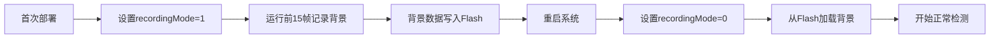

# 🔍 TI mmWave 雷达 AWRL6844 固件资源列表

> **文档创建日期**: 2025-12-20  
> **最后更新**: 2025-12-20  
> **作者**: AI Assistant  
> **数据来源**: 
> - `C:\ti\MMWAVE_L_SDK_06_01_00_01` (官方AWRL6844 SDK)
> - `C:\ti\radar_toolbox_3_30_00_06` (Radar Toolbox 3.30.00.06)
> - `D:\7.项目资料\Ti雷达项目\知识库\雷达模块\RADAR-TOOLBOX\radar_toolbox_3_30_00_06`

---

## 📋 概述

### 固件格式说明

TI mmWave雷达固件有两种主要格式：

| 格式 | 适用型号 | 说明 | 本项目是否适用 |
|------|---------|------|--------------|
| **`.appimage`** | xWRL6xxx 系列 | AWRL6844、AWRL6432、IWRL6843 等 | ✅ **是**（本项目使用） |
| **`.bin`** | xWR18xx、xWR68xx 系列 | AWR1843、AWR6843 等 | ❌ 否 |

**本文档仅列出 `.appimage` 格式的固件**，因为 AWRL6844 只支持这种格式。

### Flash配置读取功能

在TI mmWave雷达SDK中，**大多数固件Demo不支持从Flash读取配置参数**。配置通常通过UART CLI在运行时发送。只有少数特定应用的Demo实现了Flash配置读取功能，主要用于：

- ✅ **背景场景校准数据存储**
- ✅ **静态检测参考数据保存**
- ✅ **独立部署模式**（无需PC配置即可运行）
- ✅ **跨电源周期保存环境数据**

---

## 🎯 AWRL6844 专用固件列表

## 🎯 AWRL6844 专用固件列表

以下固件专门为 **AWRL6844** (xWRL684x-evm) 编译，可直接用于本项目。

### 1️⃣ **mmWave Demo（官方演示固件）** ⭐ 推荐

#### 📊 基本信息

| 项目 | 内容 |
|------|------|
| **固件名称** | mmwave_demo |
| **支持型号** | **AWRL6844 / xWRL684x** |
| **SDK版本** | MMWAVE_L_SDK 06.01.00.01 |
| **应用场景** | 通用雷达演示、目标检测、点云输出 |
| **操作系统** | FreeRTOS / No-RTOS |

#### 📂 文件路径

```
C:\ti\MMWAVE_L_SDK_06_01_00_01\examples\mmw_demo\mmwave_demo\
├── prebuilt_binaries\xwrL684x-evm\
│   └── mmwave_demo.release.appimage ✅ 预编译版本
└── xwrL684x-evm\r5fss0-0_freertos\ti-arm-clang\
    └── mmwave_demo.release.appimage ✅ 源码编译版本
```

**备用路径** (Radar Toolbox):
```
C:\ti\radar_toolbox_3_30_00_06\tools\Adc_Data_Capture_Tool_DCA1000_CLI\prebuilt_binaries\
└── xWRL6844_mmwave_demo.release.appimage ✅ 工具附带版本
```

#### 💡 为什么推荐这个固件？

1. **官方标准Demo** - TI官方维护，稳定可靠
2. **功能全面** - 支持3D点云、目标检测、范围-多普勒输出
3. **多SDK版本** - 在SDK和Toolbox中都有提供
4. **文档完善** - 有详细的用户指南和配置说明

---

### 2️⃣ **InCabin Demos（车内检测）** ⭐ 支持Flash配置

#### 📊 基本信息

| 项目 | 内容 |
|------|------|
| **固件名称** | AWRL6844_InCabin_Demos |
| **支持型号** | **AWRL6844** |
| **SDK版本** | Radar Toolbox 3.30.00.06 |
| **应用场景** | 车内乘员检测、生命体征监测、儿童遗留检测 |
| **Flash功能** | ✅ **支持校准数据Flash存储** |

#### 📂 文件路径

```
C:\ti\radar_toolbox_3_30_00_06\source\ti\examples\
└── Automotive_InCabin_Security_and_Safety\AWRL6844_InCabin_Demos\
    └── prebuilt_binaries\
        └── demo_in_cabin_sensing_6844_system.release.appimage ✅
```

**备用路径** (知识库):
```
D:\7.项目资料\Ti雷达项目\知识库\雷达模块\RADAR-TOOLBOX\radar_toolbox_3_30_00_06\
└── source\ti\examples\Automotive_InCabin_Security_and_Safety\AWRL6844_InCabin_Demos\
    └── prebuilt_binaries\
        └── demo_in_cabin_sensing_6844_system.release.appimage ✅
```

#### 🔧 Flash配置功能

- **支持校准数据Flash存储**：环境噪声基线、背景场景数据
- **支持配置参数持久化**：检测阈值、算法参数等
- **独立部署模式**：烧录后可脱离PC独立运行

---

### 3️⃣ **CAN Integration（CAN总线集成）**

#### 📊 基本信息

| 项目 | 内容 |
|------|------|
| **固件名称** | CAN_Integration |
| **支持型号** | **AWRL6844** (L6844) |
| **SDK版本** | Radar Toolbox 3.30.00.06 |
| **应用场景** | 通过CAN总线输出雷达数据 |

#### 📂 文件路径

```
C:\ti\radar_toolbox_3_30_00_06\source\ti\examples\Fundamentals\CAN_Data_Output\CAN_Integration\
└── prebuilt_binaries\
    └── can_integration_example_L6844.appimage ✅
```

---

### 4️⃣ **基础示例固件（Drivers & Kernel）**

AWRL6844 SDK包含大量驱动和内核示例固件，每个都有 FreeRTOS 和 No-RTOS 两个版本。

#### 📂 主要类别

| 类别 | 示例数量 | 路径模式 |
|------|---------|---------|
| **Driver Examples** | 50+ | `C:\ti\MMWAVE_L_SDK_06_01_00_01\examples\drivers\` |
| **Kernel Examples** | 10+ | `C:\ti\MMWAVE_L_SDK_06_01_00_01\examples\kernel\` |
| **Control Examples** | 5+ | `C:\ti\MMWAVE_L_SDK_06_01_00_01\examples\control\` |
| **DataPath Examples** | 10+ | `C:\ti\MMWAVE_L_SDK_06_01_00_01\examples\datapath\` |

#### 🔧 常用驱动示例

| 驱动类型 | 固件名称 | 功能说明 |
|---------|---------|---------|
| **Boot** | `sbl.release.appimage` | 二级引导加载器（SBL） |
| **GPIO** | `gpio_led_blink.release.appimage` | GPIO LED闪烁测试 |
| **UART** | `uart_echo.release.appimage` | UART回显测试 |
| **SPI** | `mcspi_loopback.release.appimage` | SPI回环测试 |
| **I2C** | `i2c_temperature.release.appimage` | I2C温度传感器读取 |
| **CAN** | `mcan_loopback.release.appimage` | CAN总线回环测试 |
| **EDMA** | `edma_*.release.appimage` | DMA传输示例 |
| **HWA** | `hwa_cfar_*.release.appimage` | 硬件加速器CFAR检测 |

完整路径示例：
```
C:\ti\MMWAVE_L_SDK_06_01_00_01\examples\drivers\gpio\gpio_led_blink\xwrL684x-evm\
├── r5fss0-0_freertos\ti-arm-clang\gpio_led_blink_main.release.appimage
└── r5fss0-0_nortos\ti-arm-clang\gpio_led_blink_main.release.appimage
```

---

### 5️⃣ **Hello World / Empty Template**

最简单的起始模板固件。

#### 📂 文件路径

```
C:\ti\MMWAVE_L_SDK_06_01_00_01\examples\
├── hello_world\xwrL684x-evm\
│   ├── r5fss0-0_freertos\ti-arm-clang\hello_world.release.appimage
│   ├── r5fss0-0_nortos\ti-arm-clang\hello_world.release.appimage
│   ├── system_freertos\hello_world_system.release.appimage ✅ 推荐
│   └── system_nortos\hello_world_system.release.appimage
└── empty\xwrL684x-evm\
    ├── r5fss0-0_freertos\ti-arm-clang\empty.release.appimage
    └── system_freertos\empty_system.release.appimage
```

---

## 🔧 其他雷达型号固件参考

### xWRL6432 固件 (AWRL6844的兄弟型号)

虽然不能直接用于AWRL6844，但可以作为开发参考。

#### 📂 主要固件

| 固件名称 | 路径 |
|---------|------|
| Out of Box Demo | `C:\ti\radar_toolbox_3_30_00_06\source\ti\examples\Out_Of_Box_Demo\prebuilt_binaries\out_of_box_L6432.appimage` |
| mmWave Demo | `C:\ti\radar_toolbox_3_30_00_06\source\ti\examples\Industrial_and_Personal_Electronics\mmWave_Demo\prebuilt_binaries\mmwave_demo_xwrl6432.appimage` |
| Motion & Presence | `C:\ti\radar_toolbox_3_30_00_06\source\ti\examples\Industrial_and_Personal_Electronics\Motion_and_Presence_Detection\prebuilt_binaries\...` |
| Gesture Recognition | `C:\ti\radar_toolbox_3_30_00_06\source\ti\examples\Industrial_and_Personal_Electronics\Gesture_Recognition\xWRLx432_Gesture\prebuilt_binaries\xwrl6432_gesture_recognition_demo.appimage` |
| Bike Radar | `C:\ti\radar_toolbox_3_30_00_06\source\ti\examples\Industrial_and_Personal_Electronics\Bike_Radar\prebuilt_binaries\bike_radar_demo_6432.Release.appimage` |

---

---

## 🔍 Flash配置读取功能说明

### 支持Flash配置读取的固件

目前已确认支持Flash配置功能的AWRL6844固件：

#### 1. **AWRL6844 InCabin Demos** ✅ 确认支持

- **功能**: 校准数据和配置参数Flash存储
- **用途**: 车内检测应用
- **文件**: `demo_in_cabin_sensing_6844_system.release.appimage`

### Parking Garage Sensor（停车库传感器）⚠️ 仅xWR68xx

**重要说明**: 此固件**不支持AWRL6844**，仅适用于xWR68xx系列。Flash

#### 📊 基本信息

| 项目               | 内容                         |
| ------------------ | ---------------------------- |
| **固件名称** | Parking_Garage_Sensor        |
| **支持型号** | AWR6843 / xWR68xx系列        |
| **SDK版本**  | mmWave SDK 3.5+              |
| **应用场景** | 停车库车位检测、静态物体检测 |

#### 📂 文件路径

```
知识库/雷达模块/RADAR-TOOLBOX/radar_toolbox_3_30_00_06/source/ti/examples/
└── Industrial_and_Personal_Electronics/Parking_Garage_Sensor/
    ├── docs/
    │   ├── parking_garage_sensor_68xx_users_guide.html
    │   └── parking_garage_sensor_static_detection_cli_commands.html
    ├── chirp_configs/
    │   ├── parking_garage_sensor_68xx_ISK_setFlashRecord.cfg
    │   └── parking_garage_sensor_68xx_ISK_getFlashRecord.cfg
    └── prebuilt_binaries/
        └── parking_garage_sensor_68xx_demo_isk.bin  ✅ 应用固件
```

**⚠️ 固件格式说明**：
- 该固件使用 **`.bin`** 格式（单镜像格式），而非 `.appimage` 格式
- 适用于 **xWR68xx 系列**（AWR6843 等）
- **不适用于 AWRL6844**（AWRL6844 需要分离的 SBL + AppImage 架构）

#### 🔧 Flash配置功能详解

##### **核心CLI命令**: `heatmapGenCfg`

```bash
# 命令格式
heatmapGenCfg <subframe> <recordingMode> <startRange> <endRange> <maxStaticObjBW> <maxStaticObjLen> <frameAvgFactor> <thresholdFactor>

# 参数说明
- subframe: -1 (所有子帧)
- recordingMode: 1=记录到Flash, 0=从Flash读取
- startRange: 起始距离索引 (0-40)
- endRange: 结束距离索引 (40-130)
- maxStaticObjBW: 最大静态物体带宽 (60.0)
- maxStaticObjLen: 最大静态物体长度 (3.0)
- frameAvgFactor: 帧平均因子 (10)
- thresholdFactor: 阈值因子
```

##### **使用流程**



##### **配置文件示例**

**1. 写入Flash模式** (`setFlashRecord.cfg`):

```ini
% Flash Recording Mode - 记录背景场景到Flash

% 其他配置参数...
chirpCfg 0 0 0 0 0 0 0 1
chirpCfg 1 1 0 0 0 0 0 4

% 设置Flash记录模式 (recordingMode=1)
heatmapGenCfg -1 1 0 40 130 60.0 3.0 10

% 其他CLI命令...
sensorStart
```

**2. 读取Flash模式** (`getFlashRecord.cfg`):

```ini
% Flash Read Mode - 从Flash读取背景场景

% 其他配置参数...
chirpCfg 0 0 0 0 0 0 0 1
chirpCfg 1 1 0 0 0 0 0 4

% 从Flash读取模式 (recordingMode=0)
heatmapGenCfg -1 0 0 40 130 60.0 3.0 10

% 其他CLI命令...
sensorStart
```

#### 💾 Flash存储内容

| 存储内容                  | 说明                       |
| ------------------------- | -------------------------- |
| **背景场景数据**    | 前15帧的静态环境参考数据   |
| **距离-多普勒矩阵** | 用于静态物体检测的参考矩阵 |
| **校准参数**        | 环境噪声基线数据           |

#### 📖 相关文档

- **用户指南**: `parking_garage_sensor_68xx_users_guide.html`
- **CLI命令**: `parking_garage_sensor_static_detection_cli_commands.html`
- **发布说明**: `parking_garage_sensor_68xx_release_notes.html`

---

### 2️⃣ **Automated Parking（自动停车）**

#### 📊 基本信息

| 项目               | 内容                             |
| ------------------ | -------------------------------- |
| **固件名称** | automated_parking / 18xx_parking |
| **支持型号** | AWR1843 / AWR1843AOP             |
| **SDK版本**  | mmWave SDK 3.5+                  |
| **应用场景** | 汽车自动停车辅助、ADAS           |

#### 📂 文件路径

```
知识库/雷达模块/RADAR-TOOLBOX/radar_toolbox_3_30_00_06/source/ti/examples/
└── Automotive_ADAS_and_Parking/automated_parking/
    ├── docs/
    │   ├── automated_parking_18xx_users_guide.html
    │   └── automated_parking_18xx_release_notes.html
    ├── chirp_profiles/
    │   ├── profile_parking_mimo_2d_50m_3d_10m_aop.cfg
    │   └── profile_parking_mimo_2d_50m_3d_10m_boost.cfg
    └── prebuilt_binaries/
        ├── xwr18xx_mmw_aop_demo.bin   ✅ AOP版本固件
        └── xwr18xx_mmw_demo_boost.bin ✅ Boost版本固件
```

**⚠️ 固件格式说明**：
- 该固件使用 **`.bin`** 格式（单镜像格式），而非 `.appimage` 格式
- 适用于 **xWR18xx 系列**（AWR1843、AWR1843AOP 等）
- **不适用于 AWRL6844**（AWRL6844 需要分离的 SBL + AppImage 架构）

#### 🔧 Flash配置功能

- **支持从Flash启动** (Deployment模式)
- 配置文件在启动时从Flash加载
- 支持多模式子帧配置（3D近距 + 2D远距）

#### 📖 配置特点

```ini
% 多模式子帧配置示例

% 子帧1: 3D近距检测 (0-10m)
subFrameCfg 0 0 48 0 200 1 0 ...

% 子帧2: 2D远距检测 (0-50m)  
subFrameCfg 1 0 96 0 400 1 0 ...

% Flash部署模式启用
deploymentMode 1
```

#### 📖 相关文档

- **用户指南**: `automated_parking_18xx_users_guide.html`
- **发布说明**: `automated_parking_18xx_release_notes.html`

---

## 🔍 其他潜在支持Flash的固件（需进一步验证）

以下固件从源代码分析发现包含Flash读写功能模块，但需要查看具体文档确认是否支持配置参数的Flash读取：

### 3️⃣ **High End Corner Radar（高端角雷达）**

- **型号**: AWR2944
- **路径**: `Automotive_ADAS_and_Parking/high_end_corner_radar/`
- **Flash模块**: `mmwdemo_flash.c`

### 4️⃣ **Interference Mitigation（干扰抑制）**

- **型号**: xWR16xx / xWR18xx
- **路径**: `Automotive_ADAS_and_Parking/interference_mitigation/`
- **Flash模块**: 包含Flash工具模块

### 5️⃣ **mmWave 2-Chip Cascade（双芯片级联）**

- **型号**: AWR2243 / xWR1243
- **路径**: `Automotive_ADAS_and_Parking/mmwave_2_chip_cascade/`
- **Flash模块**: 包含Flash写入脚本

### 6️⃣ **InCabin Demos（车内检测）** ⭐ AWRL6844专用

#### 📊 基本信息

| 项目               | 内容                                       |
| ------------------ | ------------------------------------------ |
| **固件名称** | AWRL6844_InCabin_Demos                     |
| **支持型号** | **AWRL6844** （本项目使用的型号）          |
| **SDK版本**  | mmWave SDK 3.5+                            |
| **应用场景** | 车内乘员检测、生命体征监测、儿童遗留检测等 |

#### 📂 文件路径

```
知识库/雷达模块/RADAR-TOOLBOX/radar_toolbox_3_30_00_06/source/ti/examples/
└── Automotive_InCabin_Security_and_Safety/AWRL6844_InCabin_Demos/
    ├── docs/
    │   └── [用户指南文档]
    └── prebuilt_binaries/
        └── demo_in_cabin_sensing_6844_system.release.appimage ✅ AWRL6844应用固件
```

**✅ 固件格式说明**：
- 该固件使用 **`.appimage`** 格式（本项目标准格式）
- **直接适用于 AWRL6844**（需配合 SBL Bootloader 使用）
- 这是少数原生支持 AWRL6844 的 Demo 固件之一

#### 🔧 Flash配置功能

- **支持校准数据Flash存储**：环境噪声基线、背景场景数据
- **支持配置参数持久化**：检测阈值、算法参数等
- **独立部署模式**：烧录后可脱离PC独立运行

#### 💡 为什么这个固件很重要？

1. **本项目使用的型号**：AWRL6844 是本项目的主要硬件平台
2. **直接可用**：`.appimage` 格式可直接用于固件烧录工具
3. **功能完整**：包含车内检测、生命体征等多种应用场景

---

### 6️⃣ **InCabin Demos（车内检测）**

- **型号**: AWRL6844
- **路径**: `Automotive_InCabin_Security_and_Safety/AWRL6844_InCabin_Demos/`
- **Flash模块**: 校准数据Flash存储

---

## ❌ 不支持Flash配置读取的固件类型

以下类型的固件Demo **通常不支持**Flash配置读取：

### 🚫 Out of Box Demo（开箱即用Demo）

- 需要通过UART CLI实时配置
- 配置参数不保存到Flash

### 🚫 People Counting（人员计数）

- 运行时动态配置
- 无Flash配置存储

### 🚫 Vital Signs（生命体征）

- 实时参数调整
- 不支持Flash预加载

### 🚫 Hand Gesture（手势识别）

- 需要灵活配置
- 无Flash持久化

---

## 🛠️ 开发自定义Flash配置功能

如果需要为自定义固件添加Flash配置读取功能，可以参考以下实现：

### 📝 实现步骤

1. **定义Flash存储区域**

```c
#define FLASH_CONFIG_ADDR   0x00070000  // Flash地址
#define FLASH_CONFIG_SIZE   4096        // 配置大小
```

2. **实现写入函数**

```c
int32_t Flash_WriteConfig(uint8_t* configData, uint32_t size) {
    // 使用Flash API写入配置
    return Flash_write(FLASH_CONFIG_ADDR, configData, size);
}
```

3. **实现读取函数**

```c
int32_t Flash_ReadConfig(uint8_t* configData, uint32_t size) {
    // 使用Flash API读取配置
    return Flash_read(FLASH_CONFIG_ADDR, configData, size);
}
```

4. **启动时加载配置**

```c
void MmwDemo_initTask(void) {
    uint8_t configData[FLASH_CONFIG_SIZE];
  
    // 尝试从Flash读取配置
    if (Flash_ReadConfig(configData, sizeof(configData)) == 0) {
        // 解析并应用配置
        MmwDemo_ApplyConfig(configData);
    } else {
        // 使用默认配置
        MmwDemo_UseDefaultConfig();
    }
}
```

### 📚 参考代码位置

**Parking Garage Sensor实现**:

```
radar_toolbox_3_30_00_06/source/ti/examples/
└── Industrial_and_Personal_Electronics/Parking_Garage_Sensor/
    └── src/
        ├── mmw_mss.c          // 主状态机
        ├── heatmap_gen.c      // Flash读写实现
        └── config_flash.c     // 配置管理
```

---

## 📖 相关文档索引

### SDK文档

| 文档                    | 路径                                  |
| ----------------------- | ------------------------------------- |
| mmWave SDK User Guide   | `docs/mmwave_sdk_user_guide.pdf`    |
| Flash Programming Guide | `docs/flash_programming_guide.pdf`  |
| CLI Command Reference   | `docs/mmwave_sdk_cli_reference.pdf` |

### Demo文档

| Demo                  | 用户指南路径                                                        |
| --------------------- | ------------------------------------------------------------------- |
| Parking Garage Sensor | `Industrial_and_Personal_Electronics/Parking_Garage_Sensor/docs/` |
| Automated Parking     | `Automotive_ADAS_and_Parking/automated_parking/docs/`             |

---

## 🎯 最佳实践

### ✅ 推荐做法

1. **首次部署先记录背景**

   - 设置 `recordingMode=1`
   - 运行足够帧数（通常15帧）
   - 确保环境稳定
2. **后续使用读取模式**

   - 设置 `recordingMode=0`
   - 快速启动，无需重新校准
3. **定期更新背景数据**

   - 环境变化时重新记录
   - 季节变换时更新参考数据

### ⚠️ 注意事项

1. **Flash写入次数限制**

   - Flash有擦写寿命限制
   - 不要频繁写入配置
   - 仅在必要时更新
2. **数据完整性检查**

   - 添加CRC校验
   - 验证读取数据有效性
   - 提供降级方案
3. **版本兼容性**

   - 配置数据格式可能随SDK版本变化
   - 添加版本标识
   - 升级时注意兼容性

---

## 🔗 相关链接

- [TI mmWave SDK官方文档](https://www.ti.com/tool/MMWAVE-SDK)
- [TI E2E社区 - mmWave Sensors](https://e2e.ti.com/support/sensors/f/1023)
- [Radar Toolbox下载](https://www.ti.com/tool/MMWAVE-RADAR-TOOLBOX)

---

## 📝 更新日志

| 日期       | 版本 | 更新内容                                  |
| ---------- | ---- | ----------------------------------------- |
| 2025-12-20 | 1.0  | 初始版本，整理支持Flash配置读取的固件列表 |

---

## 📧 反馈与支持

如有问题或建议，请通过以下方式联系：

- **项目仓库**: hhtbing-wisefido/pose-radar-ti
- **问题追踪**: 在项目Issues中提交

---

**文档路径**: `项目文档/3-固件工具/05-雷达配置文件研究/支持Flash配置读取的固件列表.md`
