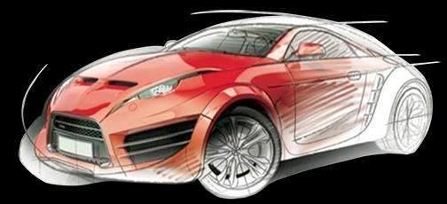
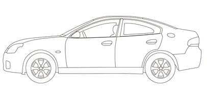
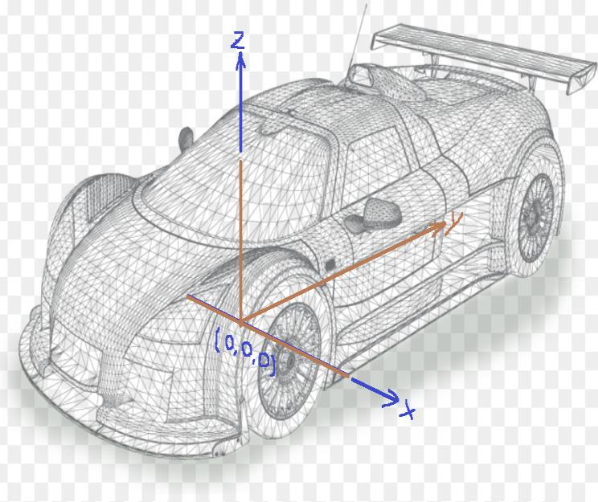
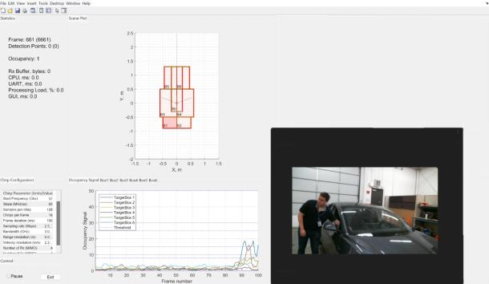

# AWRL6432: Intruder Detection Testing

> **源文件名**: AWRL6844_Intruder_Detection_Testing.pdf
> **源文件绝对路径**: `C:\ti\radar_toolbox_3_30_00_06\source\ti\examples\Automotive_InCabin_Security_and_Safety\AWRL6844_InCabin_Demos\docs\Intrusion_Detection\AWRL6844_Intruder_Detection_Testing.pdf`
> **作者**: Windows User
> **PDF标题**: AWRL6432: Intruder Detection Testing
> **创建程序**: Microsoft® PowerPoint® 2019
> **页数**: 6
> **文件大小**: 421.0 KB
> **转换时间**: 2025-12-25 14:11:05
> **提取图片**: 14 张

---

## AWRL6844: Intruder Detection Testing

<!-- 第 1 页结束 -->

## Intruder detection testing shows that AWRL6844 enables high accuracy detection

## Featured Data in following slides:

2 Row Detection

AWRL6844

Row 1
Footwell

Row 1

Seat

Row 2
Footwell

Row 2

Seat

<!-- 第 2 页结束 -->

- 
- The sensor is mounted at (x = 0, y = 0m, z = 1m) and rotated 60 degrees to face the floor.

x

(0,0)

driver

y

<!-- 第 3 页结束 -->

## Chirp parameters and system performance

Starting frequency
57
GHz
Ramp slope
60.0
MHz/us
Number of samples per chirp
128
#
Number of burst
1
#
Sampling frequency
1.25
MHz
Idle time
7
us
Ramp end time
63
us

Chirp accumulation
0
#

Burst period
1400
us

Valid sweep bandwidth
6144.1
MHz

Frame duration
100
ms

Maximum range, Rmax
1.25
m

Range resolution
2.44
cm

<!-- 第 4 页结束 -->

## Intruder Detection Performance – AWRL6844 Front Mount

Front window, take from dashboard
90%

### Test Case

### Driver Side

Front window, take from floor
100%

Front window, take from seat
100%

Front window, take from dashboard
90%

Rear window, take from floor
90%

Rear window, take from seat
100%

### Passenger Side

Front window, take from floor
100%

Front window, take from seat
100%

Rear window, take from floor
100%

Rear window, take from seat
100%

<!-- 第 5 页结束 -->

### No intruder present, zones

### all clear

### Intruder reaching into car

### Person leaning on car and

### no false alarms

### intruder alert

<!-- 第 6 页结束 -->
